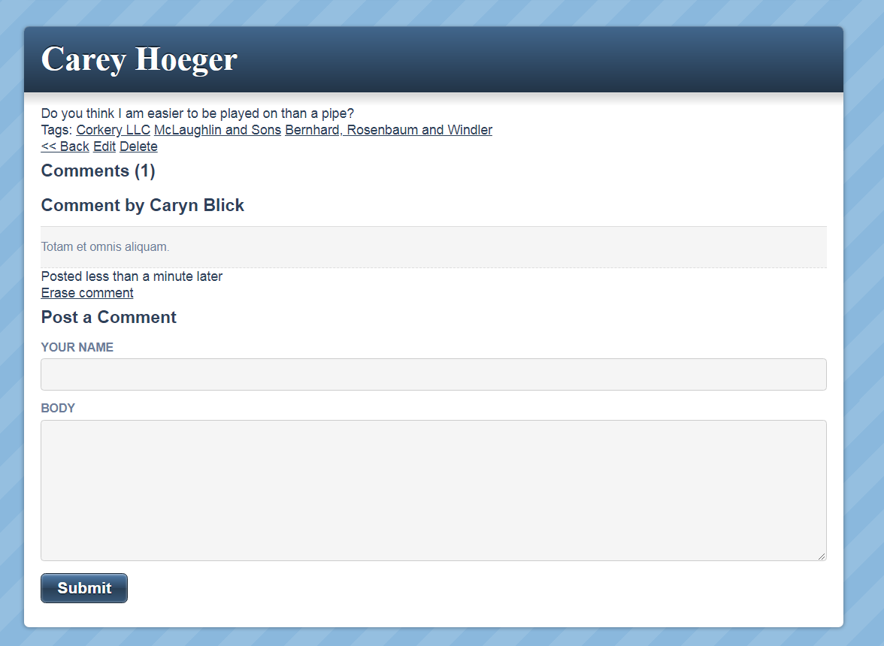

# Blogger
> A Blog about tech world.<br>



<br>A blog where people can read and write about tech.<br>

## Content

* [Features](#features)
* [Built With](#built-with)
* [Getting Start](#getting-start)
* [Contributing](#contributing)
* [Acknowledgments](#acknowledgments)
* [Author](#author)
* [License](#license)

## Features

<ul>
  <li>Visitors can make post, edit and delete</li>
  <li>Each article have a comment section</li>
  <li>Spam window to confirm create, edit or delete articles</li>
  <li>Show a count of how many comments the article has</li>
  <li>Show timestamp to see when the post was made</li>
</ul>

<ul>
  <h3>Upcoming features</h3>
  <li>Allow upload images</li>
  <li>User can make a account and login</li>
  <li>Administrator user to manage articles and comments</li>
</ul>

## Built With

- Ruby 2.7<br>
- Ruby on Rails 5.2 <br>
- RSpec (Unit testing) <br>
- Rubocop (Linter) with Stickler (CI Tool) <br>
- Git, Github and VScode <br>

## Getting Start

You can visit it at:
[heroku](https://tech-blog-794.herokuapp.com)

But if you want to run in your local machine, follow the insctructions below.

#### Install
To use this program, you will need install:
* Ruby Language - Version 2.7 - [Install guide](https://www.ruby-lang.org/en/documentation/installation/)

* Ruby on Rails - Version 5.2 - [Install guide](https://guides.rubyonrails.org/v5.0/getting_started.html#installing-rails)


#### Get a local copy
Now you need a copy of this application, if you are using Git:
```js
git clone git@github.com:SevlaMare/blogger_v3.git
```
Otherwise just hit (Download Zip) on green button (Clone or Download) at top of this page.


#### Run
To run, from the application folder, just type on terminal:
```js
rails server
```
Now you can go to your favorite web browser like Google Crome
<br>and go to this page: localhost

### Contributing

Contributions, issues and feature requests are welcome!

You can do it on [issues page](issues/).

## Acknowledgments

A special thanks for the code reviewers.

## Author

👤 **Thiago Miranda**

- Github: [@SevlaMare](https://github.com/SevlaMare)
- Twitter: [#SevlaMare)](https://twitter.com/SevlaMare)
- Linkedin: [SevlaMare)](https://www.linkedin.com/in/sevlamare)

### License

<strong>MIT</strong>

